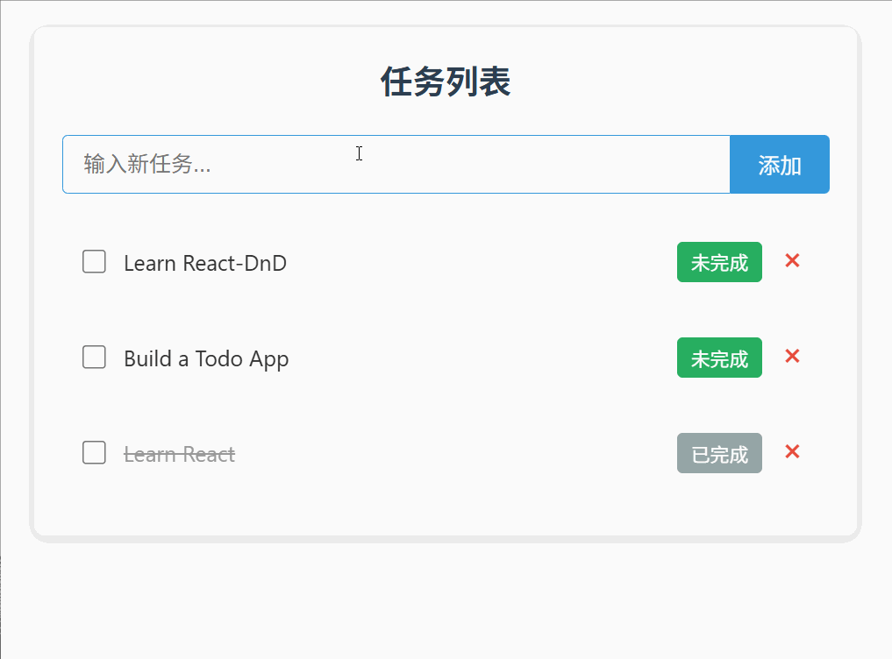

> 本文将为您带来基础 TodoList 项目的进阶教程，重点讲解如何使用 React-DnD 库为任务列表添加拖拽排序功能。建议读者先掌握基础版本实现后再继续阅读本文；若尚未了解基础 TodoList 功能，请先查阅相关教程。



## 一、引言

在基础 TodoList 项目中，我们实现了任务的添加、状态切换和删除等核心功能。为了提升用户体验，拖拽排序是一个非常实用的功能，它允许用户通过直观的拖放操作来重新排列任务顺序。React-DnD 是 React 生态中处理拖拽操作的优秀库，它提供了声明式 API，让拖拽功能的实现变得简单而优雅。

与原生拖拽 API 相比，React-DnD 封装了复杂的事件处理逻辑，将拖拽行为拆解为可复用的组件逻辑，同时支持多种拖拽场景扩展，非常适合在 TodoList 这类需要灵活交互的应用中使用。

## 二、项目结构调整

为了使拖拽功能的代码结构清晰、可维护，我们基于基础 TodoList 项目进行如下结构调整，新增拖拽相关配置目录，并明确各组件的职责边界：

    src/
    ├── App.jsx              # 应用入口组件，添加 DnDProvider 包裹全局
    ├── App.css              # 全局样式文件，新增拖拽相关视觉样式
    ├── components/
    │   ├── TodoList/
    │   │   └── TodoList.jsx # 任务列表容器，渲染 TodoItem 列表
    │   └── TodoItem/
    │       └── TodoItem.jsx # 核心改造组件，同时作为拖拽源和放置目标
    ├── context/
    │   └── TodoContext/     # 任务状态管理，新增拖拽排序方法
    ├── dnd/                 # 新增：拖拽相关配置目录，集中管理类型定义
    │   └── types.js         # 定义拖拽类型常量，实现类型统一管理
    └── main.jsx             # 应用挂载入口，无额外修改

## 三、完整实现步骤

按以下步骤完成功能落地，逐步完成拖拽排序功能的集成，每一步都包含具体代码和关键说明：

### 1. 安装 React-DnD 核心依赖

首先需要安装 React-DnD 库及其 HTML5 后端（适用于桌面端浏览器场景），如果是移动端应用，可后续替换为触摸后端：

```bash
# 使用 npm 安装
npm install react-dnd react-dnd-html5-backend

# 或使用 yarn 安装
yarn add react-dnd react-dnd-html5-backend
```

### 2. 定义拖拽类型常量

在 `dnd/types.js` 文件中定义拖拽类型，采用常量形式便于后续维护和复用，避免硬编码导致的错误：

```js
// dnd/types.js
// 定义 Todo 任务的拖拽类型，命名清晰便于区分其他拖拽项
const ItemTypes = {
  TODO_ITEM: 'todo_item',
}

// 导出拖拽类型常量
export default ItemTypes; 
```

### 3. 配置全局 DnDProvider

React-DnD 通过 `DnDProvider` 为整个应用提供拖拽上下文，需要在应用入口组件 `App.jsx` 中包裹全局组件，并配置 HTML5 后端：

```js
import React from 'react'
import './App.css'

import { DndProvider } from 'react-dnd';
import { HTML5Backend } from 'react-dnd-html5-backend'
import TodoProvider from '@/context/TodoContext/TodoProvider'

import TodoList from '@/components/TodoList/TodoList'

function App() {

  return (
    <DndProvider backend={HTML5Backend}>
      <TodoProvider>
          <TodoList />
      </TodoProvider>
    </DndProvider>
  )
}

export default App
```

### 4. 实现 TodoItem 拖拽功能

我们需要改造 TodoItem.jsx 组件，使其同时具备拖拽源（DragSource）和放置目标（DropTarget）功能，这是实现拖拽排序的关键：

改造要点：

1.  拖拽源功能：启用待办事项的拖拽操作，设置拖拽数据
2.  放置目标功能：接收其他待办事项的拖拽，处理放置操作
3.  交互优化：确保拖拽过程流畅，实现自然的排序效果

```js
// components/TodoItem/TodoItem.jsx
import React, { useRef } from 'react';
import useTodoContext from '@/context/TodoContext/useTodoContext';

import { useDrag, useDrop } from 'react-dnd';
import ItemTypes from '@/dnd/types';

export default function TodoItem({ todo, index }) {
  const { todos, deleteTodo, toggleComplete, reorderTodos } = useTodoContext();
  const divRef = useRef(null);
  // 确保todo存在
  if (!todo) {
    return null;
  }

  // 拖拽功能实现
  const [{ isDragging }, dragSourceRef] = useDrag(
    {
      // 拖拽类型，用于和目标源的accept属性匹配
      type: ItemTypes.TODO_ITEM,
      // 拖拽时传递的数据，包含当前拖拽项的id和索引
      item: { id: todo.id, index },
      // 自定义判断当前项是否正在被拖拽的逻辑
      // 当拖拽数据存在且id与当前项匹配时，视为正在拖拽
      isDragging: (monitor) => {
        return monitor.getItem() !== null && monitor.getItem().id === todo.id;
      },
      // 收集拖拽状态的回调，返回需要的状态数据
      collect: (monitor) => {
        return {
          // 获取当前是否处于拖拽状态（如果不设置isDragging配置，会使用默认实现）
          // isDragging 如果没有设置 则会调用默认的实现
          isDragging: monitor.isDragging(),
        }
      }

    }
    // 依赖数组：当todos发生变化时，重新创建拖拽源配置
    , [todos])

  const [{ isOver, canDrop }, dropTargetRef] = useDrop(
    {
      // 接受的拖拽类型，与拖拽源的type匹配
      accept: ItemTypes.TODO_ITEM,
      // 放置目标自身的数据（此处为空对象，可根据需要添加）
      item: {},
      hover: (item) => {
        // item 是拖拽源  todo 是接受拖拽
        // console.log(item, todo);

        if (item.id === todo.id) return;

        // 直接使用索引会导致拖拽混乱
        // 在拖拽过程中列表顺序发生变化（比如多次快速拖拽）， item.index 仍然会保持 初始拖拽时的旧索引 ，而不是当前列表中的实际索引。
        // console.log(item.index, index);
        // reorderTodos(item.index, index);

        // 通过 todos.findIndex 的方式获取index更可靠
        // console.log(item.id, todo.id);
        const sourceIndex = todos.findIndex(oneTodo => oneTodo.id === item.id);
        const destinationIndex = todos.findIndex(oneTodo => oneTodo.id === todo.id);
        // console.log(sourceIndex, destinationIndex);
        reorderTodos(sourceIndex, destinationIndex);

      },
      // 收集放置状态的回调，返回需要的状态数据
      collect: (monitor) => {
        return {
          // 当前是否有拖拽项悬停在上方
          isOver: monitor.isOver(),
          // 当前目标是否可以接受拖拽项
          canDrop: monitor.canDrop
        }
      },
    }
    // 依赖数组：当todos发生变化时，重新创建放置目标配置
    , [todos])

  // 注意 Drag 和 Drop 必须添加todos依赖 如果不添加 容易拖拽状态不同步 等问题  显示混乱
  dropTargetRef(dragSourceRef(divRef))

  return (
    // 拖拽时  会添加 isDragging 类名  会使当前组件 透明度 降低
    <div className={`todo-item${isDragging ? ' isDragging' : ''}`} ref={divRef}>
      <div className="todo-item-content">
        <input
          type="checkbox"
          id={`todo-${todo.id}`}
          className="todo-checkbox"
        />
        <label
          htmlFor={`todo-${todo.id}`}
          className={`todo-text ${todo.completed ? 'completed' : ''}`}
        >
          {todo.text}
        </label>
      </div>
      <button
        onClick={() => toggleComplete(todo.id)}
        className={`todo-complete-btn ${todo.completed ? 'completed' : ''}`}
        aria-label={todo.completed ? "标记为未完成" : "标记为已完成"}
      >
        {todo.completed ? "已完成" : "未完成"}
      </button>
      <button
        onClick={() => deleteTodo(todo.id)}
        className="todo-delete-btn"
        aria-label="删除任务"
      >
        ×
      </button>
    </div>
  );
}
```

## 五、常见问题及解决方案

### 1. 拖拽一次后样式不生效

**问题描述**：首次拖拽任务后，再次拖拽时透明度样式不再正确应用。

**原因分析**：React-DnD 默认的 `monitor.isDragging()` 方法在组件重新渲染后，无法准确识别当前正在被拖拽的是哪个具体组件，导致状态判断错误。

**解决方案**：实现基于任务 ID 的自定义拖拽状态判断，在 `collect` 函数中使用相同的逻辑：

```js
isDragging: (monitor) => {
    return monitor.getItem() !== null && monitor.getItem().id === todo.id;
}
```

### 2. 拖拽位置计算不准确

**问题描述**：拖拽排序后，任务的实际位置与预期不符，出现位置错乱。

**原因分析**：直接使用组件索引进行位置计算时，没有考虑到列表动态更新导致的索引变化，容易产生闭包陷阱。

**解决方案**：使用 `findIndex` 方法基于任务 ID 实时查找最新位置，确保排序操作的准确性：

```js
const sourceIndex = todos.findIndex(oneTodo => oneTodo.id === item.id);
const destinationIndex = todos.findIndex(oneTodo => oneTodo.id === todo.id);
```

### 3. 状态不同步问题

**问题描述**：拖拽操作完成后，组件界面显示与实际数据状态不一致。

**原因分析**：`useDrag` 和 `useDrop` 钩子的依赖数组配置不完整，导致组件没有在相关状态变化时重新计算。

**解决方案**：确保依赖数组包含所有必要的状态和属性：

```js
// 对于 useDrag
}, [todos]);

// 对于 useDrop
}, [todos]);
```

## 六、总结

在本教程中，我们成功地在基础 TodoList 应用上集成了 React-DnD 库，实现了任务的拖拽排序功能。通过系统性的实现步骤，我们构建了一个用户体验良好的交互式待办事项应用：

1.  **项目结构优化**：创建了专门的拖拽配置目录，使代码组织更加清晰
2.  **React-DnD 基础配置**：通过 DnDProvider 和 HTML5Backend 配置了拖拽环境
3.  **状态管理扩展**：在 TodoContext 中实现了基于 Reducer 的拖拽排序逻辑
4.  **组件功能增强**：将 TodoItem 组件改造为同时支持拖拽源和放置目标的复合组件
5.  **用户体验优化**：添加了拖拽过程中的视觉反馈样式，提升交互体验
