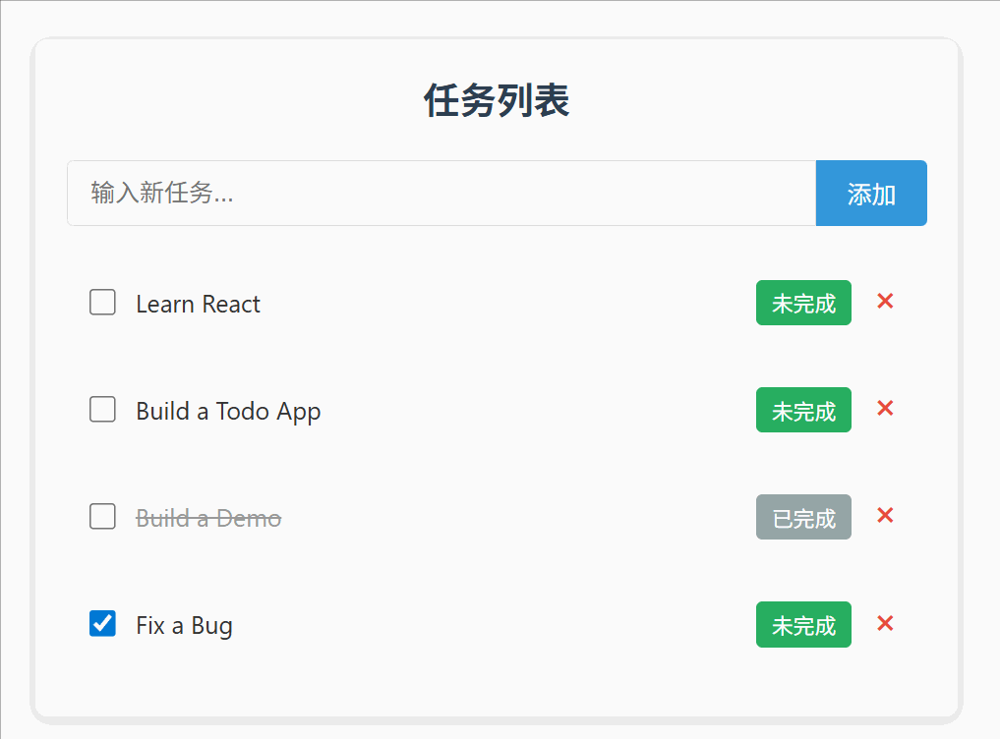

在上一篇技术分享中，我们聚焦于useDrag钩子实现Todo任务项的拖动触发逻辑，完成了任务的选中与拖拽启动功能。而拖拽交互的闭环，必然离不开放置接收环节——当用户将任务拖拽到目标位置时，如何精准判断拖动类型（单个/多个）并执行对应的排序逻辑，才是确保交互流畅性的核心。本文将详细拆解这一环节的实现思路，重点解析批量排序操作的设计与hover事件的逻辑处理。




## 核心问题：区分拖动类型，匹配差异化逻辑

任务拖拽的放置接收环节，首要解决的问题是“识别当前拖动场景”。当用户拖拽任务时，存在两种典型场景：单个任务独立拖动、多个已选中任务批量拖动。这两种场景的排序逻辑存在本质差异：单个任务只需处理“源位置”与“目标位置”的双向交换；而批量任务则需要先提取所有选中项，再整体插入目标位置，同时保持选中项内部的相对顺序。

针对这一差异，我们的技术方案分为两步：一是新增批量排序的Context操作类型，专门处理多任务排序逻辑；二是在useDrop的hover事件中添加类型判断，根据是否为批量拖动执行对应逻辑。

## 第一步：实现批量排序操作BATCH\_REORDER\_TODOS

单个任务排序可通过简单的数组元素交换实现，但批量排序需要处理“选中项提取-目标位置计算-选中项插入”三个核心步骤。为此，我们新增`BATCH_REORDER_TODOS`操作类型，封装完整的批量排序逻辑。

### 1.1 核心设计思路

批量排序的核心需求是：将所有选中的任务作为一个整体，移动到目标位置，并保持选中项在原始数组中的相对顺序。具体思路如下：

*   边界校验：排除“无选中任务”“目标位置越界”等无效场景；
*   选中项排序：确保选中任务的顺序与原始数组一致，避免排序混乱；
*   分离数组：将原始任务数组拆分为“选中任务”和“非选中任务”两个集合；
*   目标位置校准：计算选中任务在非选中数组中的实际插入位置；
*   数组重组：将选中任务整体插入目标位置，形成新的任务数组。

### 1.2 完整代码实现与解析

以下是`BATCH_REORDER_TODOS`在Context reducer中的实现代码，关键步骤已添加详细注释：

```js
case ActionTypes.BATCH_REORDER_TODOS:
  {
    // 从action中获取目标位置索引和移动方向
    const { destinationIndex, direction } = action.payload;

    // 边界条件检查：无选中任务/目标位置越界则返回原状态
    if (!state.selectedTodos.length || destinationIndex < 0 || destinationIndex >= state.todos.length) {
      return state;
    }

    // 复制原始任务数组，避免直接修改state
    let newTodos = [...state.todos];

    // 关键：按选中任务在原始数组中的顺序重新排序
    // 通过findIndex匹配id，确保排序与原始位置一致
    let tempSelectedTodos = [...state.selectedTodos].sort((a, b) => {
      return newTodos.findIndex(todo => todo.id === a.id) - newTodos.findIndex(todo => todo.id === b.id);
    });

    // 创建选中任务ID集合，用于快速过滤非选中任务
    const selectedTodoIds = new Set(tempSelectedTodos.map(todo => todo.id));

    // 从原始数组中移除所有选中任务，得到非选中任务数组
    const nonSelectedTodos = newTodos.filter(todo => !selectedTodoIds.has(todo.id));

    // 计算选中任务在非选中数组中的实际插入位置
    // 原理：通过目标位置的任务ID，找到其在非选中数组中的索引
    let actualDestinationIndex = nonSelectedTodos.findIndex(todo => todo.id === state.todos[destinationIndex].id);

    // 确保目标位置不超出非选中数组范围
    actualDestinationIndex = Math.min(actualDestinationIndex, nonSelectedTodos.length);

    // 根据移动方向微调目标位置：UP表示向上移动，需将插入位置后移一位
    if(direction === 'UP'){
      actualDestinationIndex++;
    }

    // 重组数组：将选中任务整体插入目标位置
    const resultTodos = [
      ...nonSelectedTodos.slice(0, actualDestinationIndex), // 目标位置前的非选中任务
      ...tempSelectedTodos, // 选中任务整体插入
      ...nonSelectedTodos.slice(actualDestinationIndex) // 目标位置后的非选中任务
    ];

    // 返回新状态，保持选中状态方便用户继续操作
    return {
      ...state,
      todos: resultTodos,
      selectedTodos: [...state.selectedTodos],
    }
  }
```

### 1.3 配套Action创建函数

为了在组件中调用批量排序逻辑，我们需要创建对应的action创建函数，将目标位置和移动方向作为参数传递：

```js
// 批量重新排序任务的action创建函数
batchReorderTodos: (destinationIndex, direction) => {
  dispatch({
    type: ActionTypes.BATCH_REORDER_TODOS,
    payload: { destinationIndex, direction },
  });
},
```

## 第二步：优化useDrop的hover事件，区分拖动类型

useDrop钩子的hover事件是处理“放置接收”的关键——当拖拽的任务悬停在目标任务上时，需要实时计算位置并触发排序。我们在此处添加“是否为批量拖动”的判断，分别执行单个和批量排序逻辑。

### 2.1 核心交互逻辑

hover事件的核心需求是“精准判断插入位置”：

*   批量拖动时：根据鼠标在目标任务上的垂直位置（上半部分/下半部分），确定整体插入方向（上方/下方）；
*   单个拖动时：直接匹配源任务与目标任务的位置，执行交换排序。

同时需要避免“自我交换”问题——当拖拽的任务与目标任务为同一任务（单个拖动），或目标任务属于选中任务集合（批量拖动）时，不执行任何操作。

### 2.2 完整hover事件代码实现

```js
hover: (item, monitor) => {
  if (item.selected) {
    // 场景一：批量拖拽逻辑
    // 避免将选中任务拖到自身集合内
    if (item.selectedTodos.some(selectedTodo => selectedTodo.id === todo.id)) return;

    // 获取目标任务在原始数组中的索引
    const destinationIndex = todos.findIndex(oneTodo => oneTodo.id === todo.id);

    // 计算鼠标在目标任务元素上的垂直偏移量
    // monitor.getClientOffset().y：鼠标在视口中的Y坐标
    // divRef.current.getBoundingClientRect().top：目标元素顶部在视口中的Y坐标
    const hoverOffset = monitor.getClientOffset().y - divRef.current.getBoundingClientRect().top;
    // 目标元素的半高，作为判断插入方向的阈值
    const halfHeight = divRef.current.offsetHeight / 2;

    if (hoverOffset > halfHeight) {
      // 鼠标在目标元素下半部分：将选中任务插入到目标元素下方
      batchReorderTodos(destinationIndex, 'UP');
    } else {
      // 鼠标在目标元素上半部分：将选中任务插入到目标元素上方
      batchReorderTodos(destinationIndex, 'DOWN');
    }
  } else {
    // 场景二：单个拖拽逻辑
    // 避免任务自我交换
    if (item.id === todo.id) return;

    // 关键：通过ID获取实时索引，而非依赖初始索引（避免快速拖拽导致的索引混乱）
    const sourceIndex = todos.findIndex(oneTodo => oneTodo.id === item.id);
    const destinationIndex = todos.findIndex(oneTodo => oneTodo.id === todo.id);

    // 执行单个任务排序
    reorderTodos(sourceIndex, destinationIndex);
  }
},
```

### 2.3 关键技术点解析

上述代码中，有两个极易踩坑的技术点需要重点关注：

1.  **索引获取方式**：放弃“依赖初始索引”的方式，改用`findIndex`通过任务ID获取实时索引。这是因为快速拖拽过程中，任务数组顺序会动态变化，初始索引会失效，而ID作为唯一标识能确保索引精准。
2.  **批量拖动的位置判断**：通过“鼠标垂直偏移量+元素半高”的组合，实现“hover上半部分插上方，hover下半部分插下方”的自然交互。这种设计符合用户直觉，避免了“拖拽到任务边缘时位置判断模糊”的问题。

## 功能闭环：从拖动到放置的交互优化

通过新增批量排序操作和优化hover事件逻辑，我们完成了Todo任务拖拽的完整功能闭环。实际使用中，用户可通过以下流程完成拖拽操作：

1.  单个任务拖拽：直接拖动目标任务，悬停到目标位置即可完成排序；
2.  批量任务拖拽：先选中多个任务（可通过Ctrl/Shift键辅助），拖动任意选中任务，整体悬停到目标位置，根据鼠标位置完成批量插入。

这种实现方式既保证了操作的灵活性，又通过边界校验（如越界判断、自我交换排除）确保了功能的稳定性。下图为批量拖拽的实际效果演示：

## 总结

本文通过“批量排序操作封装+hover事件类型区分”的技术方案，解决了Todo任务拖拽中“放置接收”的核心问题。核心亮点在于：

*   用ID作为索引匹配的唯一标识，避免了动态排序中的索引混乱问题；
*   批量排序时保持选中项的原始顺序，符合用户操作预期；
*   基于鼠标位置的精细判断，提升了拖拽交互的流畅性。
