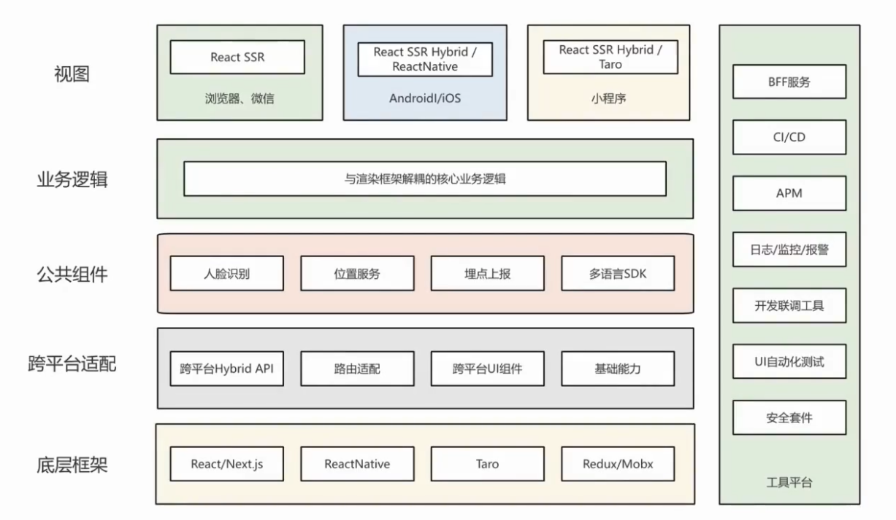
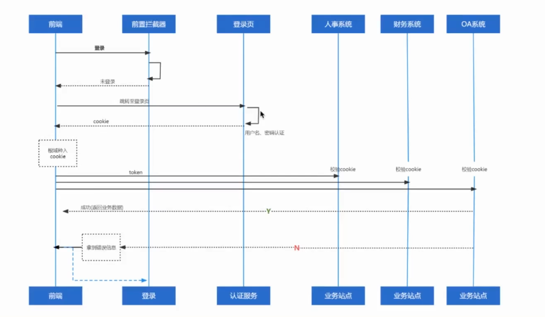
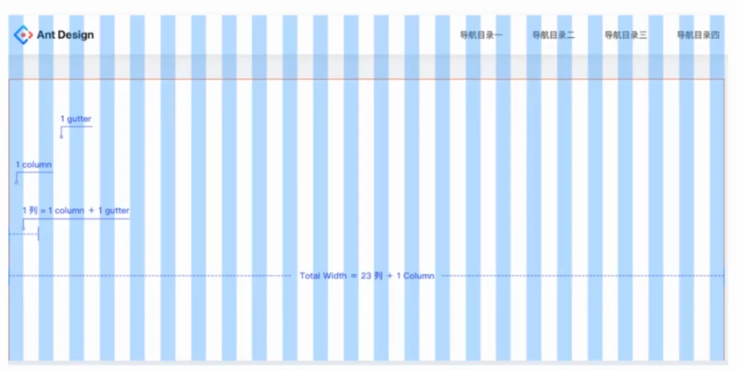

> 携程前端训练营
# React 基础与开发
[https://github.com/confidence68/pc-h5-react-demo/tree/master/react_study_demo]
## React Hooks (useState, useEffect, useCallback, useMemo, useRef, 自定义 Hook)
## Ref 用法 (useRef, createRef, forwardRef, useImperativeHandle)
## 组件通信(父子通信、兄弟通信、Context、Hooks与Class互操作)
## 状态管理（Redux Toolkit –createSlice/createAsyncThunk/Selectors）
## React 路由 (路由配置、嵌套路由、路由参数、编程式导航)
## API请求的封装(配置化 API、缓存、取消请求、useRequest Hook)
## 打包工具介绍（vite/webpack）

# React项目同构

同构是指同一套代码既能在服务端运行，也能在客户端运行。
## 同构的挑战
// ❌ 这段代码在服务端会报错（Node.js 没有 window 对象）
const width = window.innerWidth;

// ✅ 需要环境判断或放在 useEffect 中
const width = typeof window !== 'undefined' ? window.innerWidth : 0;

// ✅ 或者使用 useEffect（只在客户端执行）
useEffect(() => {
  const width = window.innerWidth;
}, []);

## 同构组件设计原则
- 避免在组件顶层使用浏览器 API（window, document, localStorage）
- 将浏览器专属代码放在 useEffect 中
- 使用环境判断：`typeof window !== 'undefined'`
- 保证服务端和客户端初始渲染结果一致

## SSR 核心三步流程
1.  **服务端渲染**
    ```jsx
    const html = ReactDOMServer.renderToString(<App />)
    // 将 React 组件转换为 HTML 字符串
    ```

2.  **嵌入模板返回**
    ```html
    <div id="root">${html}</div>
    <script src="bundle.js"></script>
    ```

3.  **客户端水合**
    ```jsx
    hydrateRoot(document.getElementById('root'), <App />)
    // 复用 DOM，绑定事件，使页面可交互
    ```
## 水合（Hydration）详解

水合是指 React 在客户端“接管”服务端渲染的 HTML 的过程，让静态页面变成可交互的应用。

- **服务端渲染的 HTML**：
  ```html
  <button class="btn">点击</button> <!-- 没有事件处理器！ -->
  ```
- **水合后**：
  ```html
  <button class="btn">点击</button> <!-- 绑定了 onClick 事件 -->
  ```

### 水合做了什么？
- 遍历服务端渲染的 DOM 节点
- 与客户端虚拟 DOM 进行对比
- 复用已有 DOM（不重新创建）
- 绑定事件处理器
- 执行 `useEffect` 副作用

## React项目同构项目实战 - 手搓一个React SSR H5项目

### 技术栈
- **React 18** - 新版本的 React
- **express** - Node.js 服务端框架
- **React Router v6** - 官方路由库
- **Webpack5** - 打包工具

### 项目地址
[https://github.com/confidence68/pc-h5-react-demo/blob/master/react_ssr/README.md]

# Next.js 开发
## Next.js 学习大纲

- **Next.js 简介**：了解框架基本概念
- **路由系统**：基础路由、动态路由、嵌套路由
- **数据获取**：服务端获取 vs 客户端获取
- **组件类型**：Server Components vs Client Components
- **API Routes**：构建后端 API
- **对比学习**：Next.js vs 手搓 SSR

## Next.js项目开发实战

### 技术栈
- **React 18** - 新版本的 React
- **Next.js 14** - 新版的 Next.js 版本

### 项目地址
https://github.com/confidence68/pc-h5-react-demo/blob/master/react_ssr_next/README.md

# 高可用Web架构及性能优化实战


# 性能优化

## 性能指标 FP FCP FMP

### 核心性能指标定义
- **FP (First Paint，首次绘制)**
  页面第一次出现“不同于空白页”的内容（如背景色、文字轮廓）的时间点。

- **FCP (First Contentful Paint，首次内容绘制)**
  页面第一次出现“实际内容”（如文本、图片）的时间点。

- **FMP (First Meaningful Paint，首次有效绘制)**
  页面“核心内容”（如主标题、商品列表）加载完成的时间点，即用户能感知到“页面有用了”的时刻。

### 提升 FP/FCP 的方法
1.  **内联关键 CSS**：把首屏样式写在 `<style>` 标签内，避免外部 CSS 阻塞渲染。
2.  **延迟加载非首屏 JS**：使用 `async`/`defer` 加载非核心脚本，避免阻塞页面首次渲染。

### 提升 FMP 的方法
1.  **优先加载核心内容**：提前请求首屏接口，让核心数据更快到达。
2.  **使用骨架屏占位**：先展示骨架屏，再填充数据，让用户感知到页面正在加载，提升体验。

## 瓶颈分析

### 通过“页面加载时序图”定位性能卡点
- 若 **domainLookup（DNS 解析）** 耗时长 → 优化 DNS（使用 CDN、DNS 预解析）
- 若 **response（接口响应）** 耗时长 → 优化接口 / 做数据缓存
- 若 **Processing（页面渲染）** 耗时长 → 优化 JS 执行、DOM 渲染

### 工具辅助
1.  使用 Chrome DevTools 的 **Performance** 面板录制加载流程，查看各阶段耗时
2.  使用 **Lighthouse** 生成性能报告，定位具体卡点

### 链路拆解
1.  按“**DNS → TCP → 接口 → 渲染**”拆分流程，逐个阶段测量耗时（例如使用 `window.performance.timing` 读取各阶段时间）

## 无网 / 弱网优化

### 针对网络差的场景
- **无网**：提供“离线页面”（如缓存历史数据展示）、断网提示；
- **弱网**：接口超时重试、资源降级（如大图换小图）、请求队列管理（避免同时发送过多请求）。

### 无网场景
1.  使用 **ServiceWorker** 缓存首页资源，断网时展示缓存页；
2.  本地存储用户常用数据（如历史订单），无网时展示缓存数据。

### 弱网场景
1.  接口设置**阶梯超时**（如先等 3s，重试再等 5s）；
2.  **资源降级**：弱网下自动切换为低分辨率图片；
3.  实现**请求队列**：弱网时把请求排队，网络恢复后批量发送。

## 资源加载，缓存

优化静态资源（JS/CSS/图片）的加载效率：

- 资源加载:压缩代码、图片格式优化(WebP)、CDN分发、懒加载(非首屏资源延迟加载);
- 缓存:利用HTTP缓存(强缓存/协商缓存)、ServiceWorker 缓存(离线可用)、本地存储(localStorage存常用数据)

#### 资源加载
- 代码压缩：JS/CSS 使用 Terser、CSSNano 压缩，图片转换为 WebP/AVIF 格式
- CDN 分发：将静态资源部署到 CDN，利用就近节点加速访问
- 懒加载：图片使用 `loading="lazy"`，组件使用 `React.lazy + Suspense` 延迟加载

#### 缓存策略
- 强缓存：为静态资源设置 `Cache-Control: max-age=31536000`（一年）
- 协商缓存：资源文件名添加哈希（如 `app.xxx.js`），更新时更换哈希
- 离线缓存：使用 ServiceWorker 缓存首屏资源

## 渲染 / 动画优化

减少页面渲染耗时、避免卡顿；
+ 渲染:减少DOM操作(用虚拟DOM)、避免重排重绘(比如用transform代替top/left);
+ 动画:用CSS动画代替JS动画(CSS由浏览器渲染线程处理，更流畅)、开启硬件加速(will-change);

### 渲染优化
1.  **减少 DOM 节点**：避免嵌套过深，删除冗余节点，降低浏览器重排成本。
2.  **避免重排重绘**：
    -   使用 `documentFragment` 批量操作 DOM，减少重排次数。
    -   用 `transform`/`opacity` 代替 `width`/`top` 等属性，避免触发布局。
3.  **开启分层渲染**：给动画元素添加 `will-change: transform`，让浏览器单独分层，提升性能。

### 动画优化
1.  **优先使用 CSS 动画**：用 `@keyframes` 等 CSS 动画代替 JS 动画，利用浏览器渲染线程，更流畅。
2.  **避免动画中操作 DOM**：不要在动画帧中读取布局属性（如 `offsetWidth`）或操作 DOM，防止强制同步布局。

## 接口优化

提升接口请求效率：
+ 接口合并(多个请求合并为一个)、接口缓存(重复请求读缓存)、接口异步并行(非依赖的请求同时发);
+ 数据压缩(接口返回Gzip格式)、字段裁剪(只返回需要的字段)。
#### 请求效率
1.  **接口合并**：将多个独立接口合并为一个（例如“用户信息 + 订单列表”合并请求），减少网络往返次数。
2.  **接口缓存**：使用 Redis 缓存高频接口（如商品列表），并设置合理的过期时间，避免重复请求。
3.  **并行请求**：对非依赖接口使用 `Promise.all` 同时发送，避免串行等待，提升整体响应速度。

#### 数据传输
1.  **数据压缩**：后端开启 Gzip 压缩，接口返回压缩后的数据，减少传输体积。
2.  **字段裁剪**：接口只返回前端需要的字段（如不返回无用的 `createdAt` 字段），降低数据量。

## 渲染方式

选择更高效的页面渲染方案：
+ 服务端渲染(SSR):首屏内容由后端渲染好再返回，提升FCP/FMP;
+ 预渲染:构建时提前渲染静态页面;
+ 同构渲染:一套代码同时支持SSR和客户端渲染。

### SSR（服务端渲染）
1.  使用 Next.js/Remix 等框架实现，首屏内容由后端渲染后返回，可显著提升 FCP/FMP。
2.  实施 SSR 缓存，例如缓存首页渲染结果，设置 5 分钟更新一次，减轻服务端压力。

### 预渲染
1.  使用 `prerender-spa-plugin` 在构建时渲染静态页面，适合静态内容较多的页面，可直接部署静态 HTML。

### 同构渲染
1.  一套代码同时支持 SSR（首屏渲染）和客户端渲染（交互），兼顾首屏性能与后续交互体验。

# 中台系统开发

## 技术方案

### A. SSO单点登陆
- 单点登录的注意事项，鉴权如何做

#### 什么是单点登录
- 单点登录（Single Sign-On，SSO）是一种用户认证方式，它允许多个应用系统共享一个身份认证中心，用户只需登录一次，即可访问所有相互信任的应用系统。
- 一次性鉴别登陆，获得关联系统权限
  
#### 信息共享
- 办公系统由数百个子系统构成,如何共享

#### 安全性怎么解决
认证系统生成加密凭据ticket交换信息


#### 有什么缺点
1.不利于重构
  因为涉及的系统很多，要重构必须要兼容所有系统，可能很耗时

2.无人看守桌面
  因为只需登录一次，所有授权的应用系统都可以访问，可能导致一些重要信息泄露

### B. 通用权限管理
- 权限怎么做，角色如何管理

#### 功能维度

#### 岗位维度

### C. 中间件
- 携程常用中间件介绍

#### 携程常用中间件分类
- **数据存储类**：redis、mysql
- **配置管理类**：qconfig
- **消息队列类**：qmq、kafka
- **监控告警类**：metric、cat
- **日志类**：clog

#### 几个注意点
1.  中间件在服务端运行
2.  部分中间件如果想在客户端运行，需包装成一个 http 服务

### D. 统一交互设计
- 中台交互设计规范，及常用UI组件介绍
- Ant Design、Element UI、Zent

# Ant Design

## 布局系统

### 1.统一的画板尺寸
使用中台系统的用户的主流分辨率主要为1920、1440和1366，个别系统还存在1280的显示设备，为了尽可能减少沟通与理解的成本，有必要在组织内部统一设计板的尺寸。Antd预设的画板尺寸为1440。我们团队的画板尺寸也采用的是1440

### 2.适配方案
左右布局:常见的做法是将左边的导航栏固定，对右边的工作区域进行动态缩放。
上下布局:做法是对两边留白区域进行最小值的定义，当留白区域到达限定值之后再对中间的主内容区域进行动态缩放

### 3.栅格系统
Ant Design采用24栅格体系。以上下布局的结构为例，对内容区域进行24栅格的划分设置，如下图所示。页面中栅格的Guter 设定了定值，即浏览器在一定范围扩大或缩小，栅格的Colurmn宽度会随之扩大或缩小，但Gutter的宽度值固定不变。


### Layout 基本布局
可协助进行页面级整体布局：
- **Header**：顶部布局，自带默认样式，其下可嵌套任何元素，只能放在 Layout 中。
- **Sider**：侧边栏，自带默认样式及基本功能，其下可嵌套任何元素，只能放在 Layout 中。
- **Content**：内容部分，自带默认样式，其下可嵌套任何元素，只能放在 Layout 中。
- **Footer**：底部布局，自带默认样式，其下可嵌套任何元素，只能放在 Layout 中。

#### 示例代码
1.  基础布局（Header + Content + Footer）
```jsx
<Layout>
  <Header>Header</Header>
  <Content>Content</Content>
  <Footer>Footer</Footer>
</Layout>
```

2.  带侧边栏布局（Header + Sider + Content + Footer）
```jsx
<Layout>
  <Header>Header</Header>
  <Layout>
    <Sider>Sider</Sider>
    <Content>Content</Content>
  </Layout>
  <Footer>Footer</Footer>
</Layout>
```

3.  顶部 Header + 右侧侧边栏 布局
```jsx
<Layout>
  <Header>Header</Header>
  <Layout>
    <Content>Content</Content>
    <Sider>Sider</Sider>
  </Layout>
  <Footer>Footer</Footer>
</Layout>
```

4.  左侧侧边栏 + 顶部 Header 布局
```jsx
<Layout>
  <Sider>Sider</Sider>
  <Layout>
    <Header>Header</Header>
    <Content>Content</Content>
    <Footer>Footer</Footer>
  </Layout>
</Layout>
```

### 栅格
1.  基于行（row）和列（col）定义信息区块
2.  一个 row 中的 col 总和不超过 24，多余的另起一行
3.  栅格系统基于 flex 布局，在父节点内可水平对齐（居左、居中、居右、等宽排列、分散排列），子元素之间支持顶部对齐、垂直居中对齐、底部对齐

### 间距 Space
1.  避免组件紧贴在一起，拉开统一的空间
2.  适合行内元素的水平间距
3.  可以设置各种水平、垂直对齐方式

### 导航组件 - 面包屑
- **作用**：显示当前页面在系统层级结构中的位置，并能向上返回。
- **何时使用**：
  1.  当系统拥有超过两级以上的层级结构时；
  2.  当需要告知用户「你在哪里」时；
  3.  当需要向上导航的功能时。

### 导航组件 - Menu 导航菜单
- **作用**：导航菜单是网站的核心，用户依赖它在各个页面间跳转。
- **常见分类**：
  - **顶部导航**：提供全局性的类目和功能入口。
  - **侧边导航**：提供多级结构，用于收纳和排列网站架构。

### 数据录入
组件用于网站的内容交互，比如Input.Select.CheckBox.Radio等

### Form表单组件
最主要两个用途
- 1.创建一个实体接收数据
- 2.数据校验:比如不能为空，只可是数字

### 数据展示组件
列表展示，可承载文字、列表、图片、段落，常用于后台数据展示页面。

### 表格展示组件
+ 1.当有大量结构化的数据需要展现时
+ 2.需要对数据进行排序、搜索、分页、自定义操作等复杂行为时

### 反馈交互组件
loading加载、alert警告、message全局提示、modal对话框

# Ant Design Pro
Antd Pro 是基于 Antd 开发的模板组件，提供了更高级的抽象支持，开箱即用，可以理解为增强版 Antd。

1.  **布局类**
    提供一个标准又不失灵活的中后台标准布局，一键切换布局，自动生成菜单等功能。

2.  **数据录入类**
    在 Form 基础上增加一些语法糖，帮助我们快速开发一个表单，如高级表单、浮层表单等。

3.  **数据展示类**
    Protable、EditProtable 用法，api 介绍。

PageContainer 封装了 antd 的PageHeader 组件，增加了tabList 和 content。
ProCard页面容器卡片，提供标准卡片样式，卡片切分以及栅格布局能力。
ProForm 在原来的Form 的基础上增加一些语法糖和更多的布局设置，帮助我们快速的开发一个表单
ProTable 的诞生是为了解决项目中需要写很多 table 的样板代码的问题，所以在其中做了封装，集成了很多常用的逻辑。这些封装可以简单地分类为**预设行为**与**预设逻辑**。
可编辑表格 `EditableProTable` 与 `ProTable` 的功能基本相同。为了方便使用，`EditableProTable` 增加了一些预设，关掉了查询表单和操作栏，同时修改了 `value` 和 `onChange`，使其可以方便地继承到 antd 的 Form 中。

# Antv-x6
X6 是 AntV 旗下的图编辑引擎，提供了一系列开箱即用的交互组件和简单易用的节点定制能力，方便我们快速搭建流程图、DAG 图、ER 图等图应用。

## Canvas 和 SVG 比较
它们是两大基于浏览器的渲染方案，在选择图表库的时候，用户有时也会在这两者之间纠结，到底该用哪一种呢？

### 一、可扩展性
1.  **SVG** 是基于矢量的点、线、形状和数学公式来构建的图形，该图形是没有像素的，放大缩小不会失真。
2.  **Canvas** 是由一个个像素点构成的图形，放大会使图形变得颗粒状和像素化（模糊）。
    - SVG 可以在任何分辨率下以高质量的打印，Canvas 不适合在任意分辨率下打印。

### 二、渲染能力
1.  当 SVG 很复杂时，它的渲染就会变得很慢，因为在很大程度上去使用 DOM 时，渲染会变得很慢。
2.  Canvas 提供了高性能的渲染和更快的图形处理能力，例如：适合制作 H5 小游戏。
    - 当图像中具有大量元素时，SVG 文件的大小会增长得更快（导致 DOM 变得复杂），而 Canvas 并不会增加太多。

## Hello World, SVG 代码解析

1.  **基本结构**：SVG 代码以 `<svg>` 元素开始，包含开启标签 `<svg>` 和关闭标签 `</svg>`。
2.  **文档属性**：`width` 和 `height` 属性可设置此 SVG 文档的宽度和高度。`version` 属性可定义所使用的 SVG 版本，`xmlns` 属性可定义 SVG 命名空间。
3.  **矩形元素**：`<rect>` 用来创建一个矩形，通过 `fill` 把背景颜色设为黄色。
4.  **圆形元素**：SVG 的 `<circle>` 用来创建一个圆。`cx` 和 `cy` 属性定义圆中心的 x 和 y 坐标。如果忽略这两个属性，那么圆点会被设置为 `(0, 0)`。`r` 属性定义圆的半径。这里是一个半径 80px 的绿色圆圈，`<circle>` 绘制在红色矩形的正中央（向右偏移 150px，向下偏移 115px）。
5.  **轮廓样式**：`stroke` 和 `stroke-width` 属性控制如何显示形状的轮廓。我们把圆的轮廓设置为 4px 宽，红色边框。
6.  **填充颜色**：`fill` 属性设置形状内的颜色。我们把填充颜色设置为黄色。

---

### 示例代码
```svg
<svg version="1.1"
     baseProfile="full"
     width="300" height="200"
     xmlns="http://www.w3.org/2000/svg">

  <rect width="100%" height="100%" stroke="red" stroke-width="4" fill="yellow" />

  <circle cx="150" cy="100" r="80" fill="green" />

  <text x="150" y="115" font-size="16" text-anchor="middle" fill="white">RUNOOB SVG TEST</text>

</svg>
```

## 引用 SVG 文件

### 1. Embed
- **优势**：所有主要浏览器都支持，并允许使用脚本
- **缺点**：不推荐在 HTML4 和 XHTML 中使用（但在 HTML5 允许）
```html
<embed src="circle1.svg" type="image/svg+xml" />
```

### 2. Object
- **优势**：所有主要浏览器都支持，并支持 HTML4、XHTML 和 HTML5 标准
- **缺点**：不允许使用脚本
```html
<object data="circle1.svg" type="image/svg+xml"></object>
```

### 3. Iframe
- **优势**：所有主要浏览器都支持，并允许使用脚本
- **缺点**：不推荐在 HTML4 和 XHTML 中使用（但在 HTML5 允许）
```html
<iframe src="circle1.svg"></iframe>
```

### 4. a 标签
```html
<a href="static/circle1.svg">查看 SVG 文件</a>
```

## 常见 SVG 画图类开
- **Line**：元素是用来创建一个直线
- **Polygon**：多边形
- **Polyline**：多段形
- **Path**：路径（参考链接：https://blog.csdn.net/weixin_39868379/article/details/114403129）
- **Text**：文本
- **Stroke 属性**：用于定义图形的轮廓样式
- **其它**：阴影、模糊、渐变

## X6 核心概念

- **Graph**：最重要的一个类，是图的载体。它包含了图上的所有元素（节点、边等），同时挂载了图的相关操作（如交互监听、元素操作、渲染等）。
- **Node**：节点。我们可以通过 JSON 数据来快速添加节点和边到画布中。在 X6 的 `Shape` 命名空间中内置了一些基础节点，如 `Rect`、`Circle`、`Ellipse` 等，可以使用这些节点的构造函数来创建节点。
- **Edge**：边。通过 `source` 和 `target` 选项指定边的源节点和目标节点，然后通过 `graph.addEdge` 方法将边添加到画布。边添加到画布后将触发画布重新渲染，最后边被渲染到画布中。
