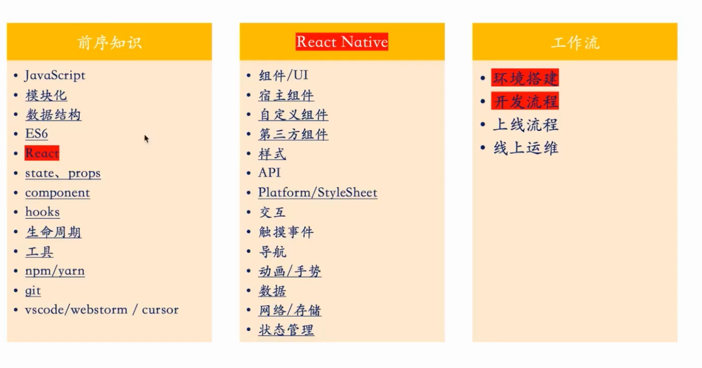
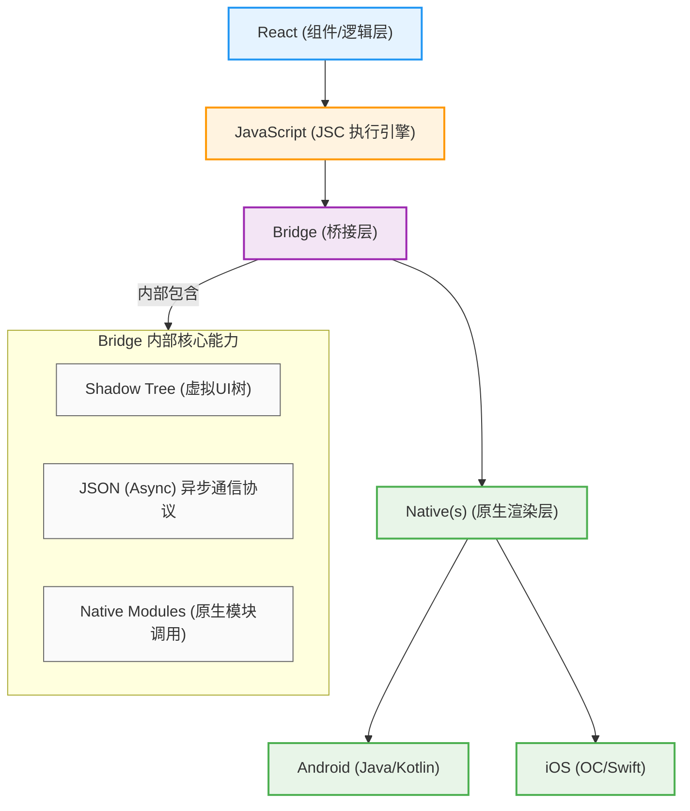
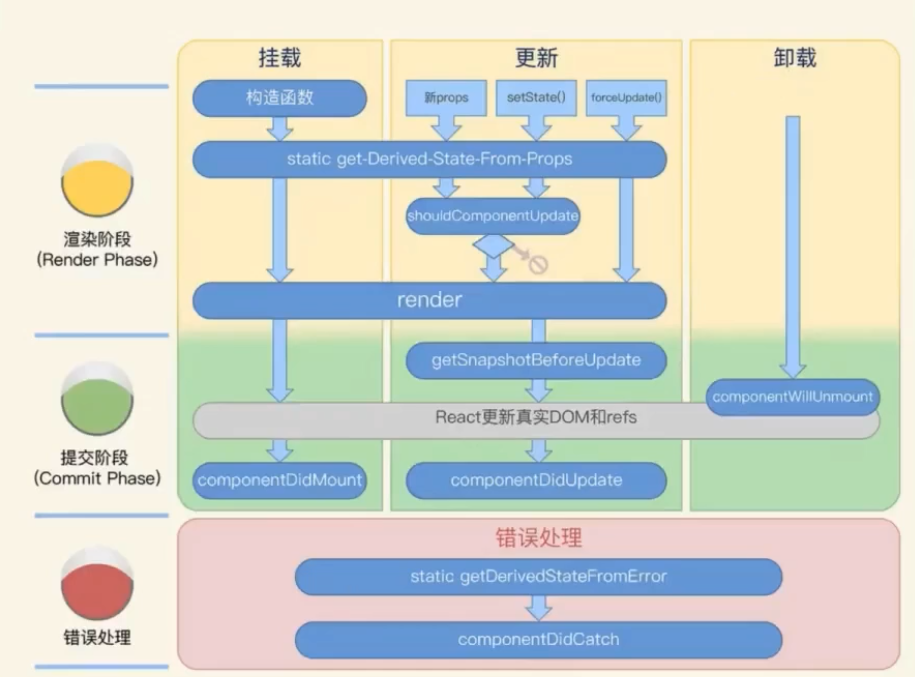
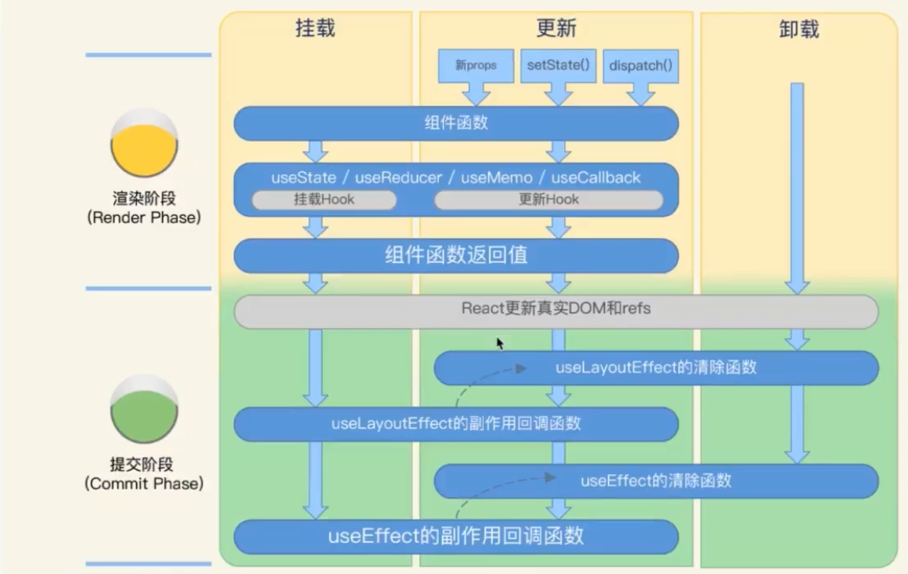
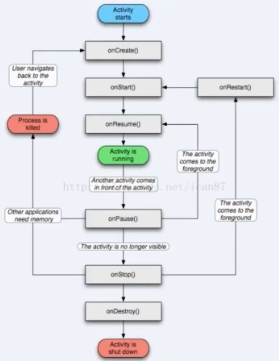
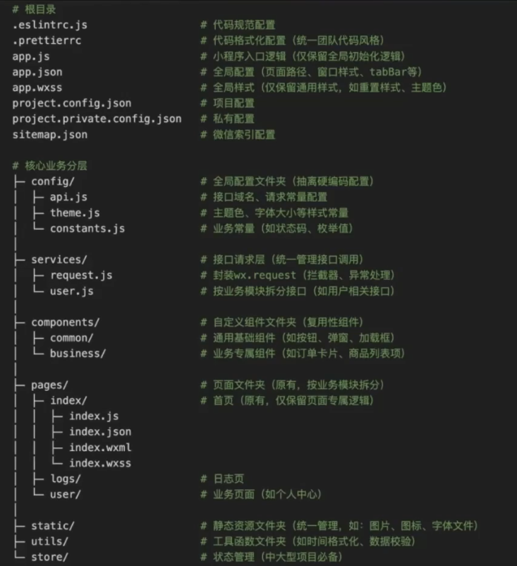
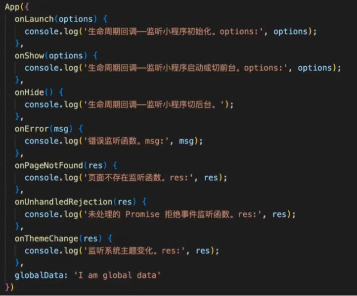
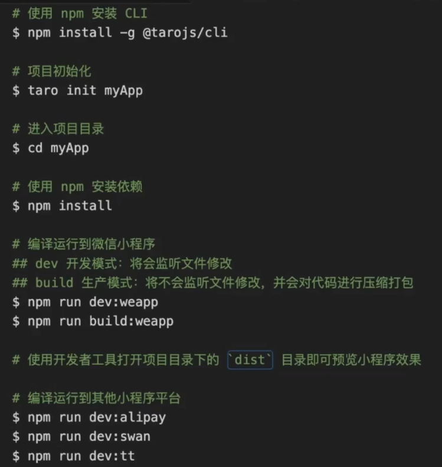

# App开发 RN

## App技术方案

- **原生开发**：针对 Android / iOS 分别开发，需要两套独立代码。
- **跨平台开发**：以 H5 / React Native / Flutter 等技术为代表，核心优势是**一套代码，多端运行**。

1.  **开发成本和效率**：原生开发成本高、效率低；跨平台开发能显著降低成本、提升效率。
2.  **动态能力**：跨平台方案（尤其是 H5）通常具备更强的动态更新能力，而原生应用的更新受限于应用商店审核。

### 技术方案对比表

| 技术方案 | Web容器             | React Native     | Flutter  |
| -------- | ------------------- | ---------------- | -------- |
| 开发语言 | html/css/javascript | Javascript/React | Dart     |
| 技术栈   | 前端                | 偏前端           | 偏客户端 |
| 动态能力 | 支持                | 支持             | 不支持   |
| 渲染能力 | 差                  | 一般             | 好       |
| 社区生态 | 活跃                | 活跃             | 活跃     |

## React Native

### RN简介
React Native 是 Facebook 推出的一种开发原生移动应用的框架，它使用类似于 React 的语法和组件化开发模式，可以同时支持 iOS 和 Android 平台。

React Native 的目标是让开发者只需要掌握 JavaScript 和 React 的基础知识，就可以快速地开发出高质量的原生应用。

### RN特点
- 更适用于前端开发的JavaScript和React开发方案
- HotReload 开发简单
- React有着成熟的社区
- 强大的热更新能力
- 官方的持续优化



### React Native 旧架构

**架构图**：


**核心特点**：
- 客户端的 JSC 环境中运行的 RN 业务代码
- 采用 Android / iOS 系统渲染 UI 组件，达到原生体验
- 通过 Bridge 完成 JS 代码和原生端 API 及组件的调用

## RN基础

### 基本组件
| REACT NATIVE UI 组件 | ANDROID 原生视图 | IOS 原生视图     | WEB 标签                | 说明                                                              |
| -------------------- | ---------------- | ---------------- | ----------------------- | ----------------------------------------------------------------- |
| `<View>`             | `<ViewGroup>`    | `<UIView>`       | A non-scrolling `<div>` | 一个支持使用 flexbox 布局、样式、一些触摸处理和无障碍性控件的容器 |
| `<Text>`             | `<TextView>`     | `<UITextView>`   | `<p>`                   | 显示、样式和嵌套文本字符串，甚至处理触摸事件                      |
| `<Image>`            | `<ImageView>`    | `<UIImageView>`  | ``                 | 显示不同类型的图片                                                |
| `<ScrollView>`       | `<ScrollView>`   | `<UIScrollView>` | `<div>`                 | 一个通用的滚动容器，可以包含多个组件和视图                        |
| `<TextInput>`        | `<EditText>`     | `<UITextField>`  | `<input type="text">`   | 供用户可以输入文本                                                |

### 样式
- 样式值必须是一个普通的 JavaScript 对象
- 样式名遵循 CSS 命名，使用驼峰命名：`backgroundColor`
- 可以通过 `style` 属性和 `StyleSheet.create` 定义组件样式
- 样式值不支持一些 CSS 特有的单位，例如 `em`、`rem` 等
- 尺寸使用的是设备无关的逻辑像素（dp）
- 内联样式、组合样式、通用样式

#### 样式使用
- **内联样式**：直接写在组件 `style` 属性中的对象
  ```jsx
  <Text style={{color: 'green', fontSize: 30}}>早上好</Text>
  ```

- **组合样式**：通过数组形式，同时应用多个样式对象（可以是 `StyleSheet` 定义的样式 + 内联样式）
  ```jsx
  <Text style={[styles.text, {color: 'blue'}]}>晚上好</Text>
  ```

- **通用样式**：通过 `StyleSheet.create` 统一创建，可在多处复用的样式
  ```js
  const styles = StyleSheet.create({
    layout: {
      margin: 30
    },
    itemLayout: {
      marginVertical: 20
    },
    text: {
      fontSize: 20,
      color: 'red'
    }
  })
  ```
  这些样式在组件中通过 `styles.layout`、`styles.itemLayout`、`styles.text` 等方式引用。

### 布局
- 布局引擎：Yoga
- React Native 的主要布局方式是基于 Flexbox
- `flexDirection` 默认垂直排序（column）
- 使用 `justifyContent` 和 `alignItems` 控制子元素在主轴和次轴的排列方式
- `position` 只支持 `relative`（默认）和 `absolute`
- 宽高可设为自适应（默认）、百分比、固定值

#### 布局示例
```jsx
import React from "react";
import { StyleSheet, Text, View } from "react-native";

const Flex = () => {
  return (
    <View style={[styles.container, {
      flexDirection: "column"
    }]}>
      <View style={{ flex: 1, backgroundColor: "red" }} />
      <View style={{ flex: 2, backgroundColor: "darkorange" }} />
      <View style={{ flex: 3, backgroundColor: "green" }} />
      <View style={{ height: 50, backgroundColor: '#BA55D3' }}></View>
    </View>
  );
};

const styles = StyleSheet.create({
  container: { flex: 1, padding: 20 },
});

export default Flex;
```

##### 布局要点解析
1.  **容器布局**：
    -   根容器 `container` 使用 `flex: 1` 占满父级空间，`padding: 20` 设置内边距。
    -   通过组合样式 `[styles.container, { flexDirection: "column" }]`，明确主轴为垂直方向（React Native 默认也是 `column`）。
2.  **子元素布局**：
    -   前三个子视图使用 `flex` 属性按 **1:2:3** 的比例分配剩余空间，分别显示为红、橙、绿三色。
    -   最后一个子视图使用固定高度 `height: 50`，不参与 flex 比例分配，显示为紫色。
3.  **布局逻辑**：
    -   垂直方向依次排列，前三个子视图按比例分配高度，最后一个子视图固定高度，整体填满容器空间。

### props

- 组件的属性本质是 **JavaScript 对象**
- 支持传递基础数据类型，也支持传递函数、子组件等复杂类型
- 属性是 **不可变** 的，组件内部不能直接修改 props
- 外部属性变更时，会触发组件重新渲染

#### 代码示例
```jsx
export default function Profile() {
  return (
    <Avatar
      person={{ name: 'Lin Lanying', imageId: '1bX5QH6' }}
      size={100}
    />
  );
}

function Avatar({ person, size }) {
  // 在这里 person 和 size 是可访问的
}
```

### state
- **State 是 React 中管理组件内部状态的机制**
- **State 的改变会引起组件的重新渲染**
- 状态相关流程：
  - 状态初选
  - 状态确定
  - 状态声明
  - 状态更新
- **可以计算出来的不是状态**

#### 代码示例
```jsx
import {useState} from "react";
import {Button, StyleSheet, Text, View} from "react-native";

const StateDemo = () => {
  const [count, setCount] = useState(initialState: 0);

  return (
    <View style={styles.container}>
      <Text>{count}</Text>
      <Button title="+" onPress={() => setCount(value: count + 1)} />
      <Button title="-" onPress={() => setCount(value: count - 1 > 0 ? count - 1 : 0)} />
    </View>
  );
};

const styles = StyleSheet.create({
  container: {
    marginTop: 200,
    alignItems: 'center'
  }
});

export default StateDemo;
```

## RN交互

### 触摸处理
- 常见的触摸手势：点击（长按、双击）、滑动
- 事件处理与 Web 开发中的事件处理非常相似
- 事件冒泡和捕获遵循 DOM 标准
- 一般用 Touchable 系列组件响应事件

### 代码示例
```jsx
import { Alert, StyleSheet, Text, TouchableOpacity, View } from 'react-native';

export default function App() {
  const handlePress = () => { Alert.alert('Button Pressed'); };
  const handleLongPress = () => { Alert.alert('Button Long Pressed'); };
  const handleDoublePress = () => { Alert.alert('Button Double Pressed'); };

  return (
    <View style={styles.container}>
      <TouchableOpacity
        style={styles.button}
        onPress={handlePress}
        onLongPress={handleLongPress}
        onDoublePress={handleDoublePress}
      >
        <Text style={styles.text}>Press me</Text>
      </TouchableOpacity>
    </View>
  );
}
```

### 动画

#### Animated
- 以声明的形式定义动画的输入与输出
- 支持组合动画、跟踪状态值、跟踪手势

#### LayoutAnimation
- 作用于全局范围
- 用于更新 flexbox 布局

#### 代码示例（Animated 淡入动画）
```jsx
import React, { useRef, useEffect } from 'react';
import { Animated } from 'react-native';

const FadeInView = (props) => {
  // 透明度初始值设为 0
  const fadeAnim = useRef(new Animated.Value(0)).current;

  useEffect(() => {
    // 随时间变化而执行动画
    Animated.timing(
      fadeAnim, // 动画中的变量值
      {
        toValue: 1, // 透明度最终变为 1，即完全不透明
        duration: 10000, // 让动画持续一段时间
      }
    ).start(); // 开始执行动画
  }, [fadeAnim]);

  return (
    <Animated.View // 使用专门的可动画化的 View 组件
      style={{
        ...props.style,
        opacity: fadeAnim, // 将透明度绑定到动画变量值
      }}
    >
      {props.children}
    </Animated.View>
  );
};

export default FadeInView;
```

### 导航
- 使用官方推荐的导航库 **React Navigation**
- 安装命令：
  ```bash
  npm install @react-navigation/native @react-navigation/stack
  ```
- React Navigation 提供了简单易用的跨平台导航方案
- 提供多种导航组件，如翻页、tab 选项卡、抽屉等
- 官方文档：https://reactnavigation.org/


## RN生命周期

- 组件生命周期
- 响应式 Effect 生命周期
- 页面生命周期







## RN组件化
- 基于组件（函数/类组件）的架构模式
  - 原生组件（宿主组件）
  - 自定义组件
  - 第三方组件

## RN开发工具
- flipper
- React Native DevTools
- LogBox

## RN状态管理Redux

| 特性          | Redux  | Rematch | Redux-Toolkit | Recoil      | Mobx   |
| ------------- | ------ | ------- | ------------- | ----------- | ------ |
| 官方/生态丰富 | ✅      | ❌       | ✅             | ❌           | ❌      |
| TS友好        | ✅      | ✅       | ✅             | ✅           | ✅      |
| 使用人数      | 高     | 低      | 高            | 低          | 低     |
| 编程范式      | 函数式 | 函数式  | 函数式        | 原子+选择器 | 响应式 |
| 冗余/模板代码 | 多     | 低      | 低            | 低          | -      |
| 上手难度      | 难     | 低      | 中            | 难          | 难     |

### 核心思想
State 驱动 View 更新，用户操作 View 触发 Action，再通过 Action 来更新 State。

### Redux 简介
Redux 是一个使用叫作 "actions" 的事件去管理和更新应用状态的模式和工具库。
它以集中式 Store（centralized store）的方式对整个应用中使用的状态进行集中管理，其规则确保状态只能以可预测的方式更新。

### Redux 三大原则
1.  **单一数据源**
2.  **State 是只读的**
3.  **使用纯函数来执行修改**

-   **Actions** → **State** → **View** → **Actions**

### Action
- 具有 `type` 字段的普通 JavaScript 对象。
- 可以将 action 视为描述应用程序中发生了什么的事件。

**代码示例：**
```js
const addTodoAction = {
  type: 'todos/todoAdded',
  payload: 'Buy milk'
}
```

### Reducer
- 纯函数，接收当前的 `state` 和一个 `action` 对象。
- 必要时决定如何更新状态，并返回新状态。

**代码示例：**
```js
const initialState = { value: 0 }

function counterReducer(state = initialState, action) {
  // 检查 reducer 是否关心这个 action
  if (action.type === 'counter/increment') {
    // 如果是，复制 `state`
    return {
      ...state,
      // 使用新值更新 state 副本
      value: state.value + 1
    }
  }
  // 返回原来的 state 不变
  return state
}
```

### Store
- Redux 的核心，整合 `action` 和 `reducer`，存放应用的 State。

**代码示例：**
```js
import { createStore } from 'redux'
// 创建 store
const store = createStore(reducer)
```

## RN集成应用

1. 纯 React Native 工程，整个应用完全由 React Native 构建，所有页面均为 RN 页面。
2. 混合工程，混合工程支持多种页面嵌套模式：

- **原生页面**：完全由原生代码（如 Android、iOS）实现的页面。
- **RN 页面**：完全由 React Native 实现的页面。
- **原生混嵌 RN**：在原生页面中嵌入 React Native 视图/组件。
- **RN 混嵌原生**：在 React Native 页面中嵌入原生视图/组件。

## RN环境搭建

### 简易沙盒环境 Expo
1.  安装 Expo CLI：
    ```bash
    npm install -g expo-cli
    ```
2.  初始化项目：
    ```bash
    expo init Demo
    ```
3.  进入项目目录：
    ```bash
    cd Demo
    ```
4.  启动项目：
    ```bash
    npm start
    ```

#### 运行方式
-   **模拟器**：在 Xcode 中通过 AppStore 配置
-   **真机（iOS）**：在应用商店下载 Expo Go

### 完整原生环境
官方文档：https://reactnative.cn/docs/environment-setup

## RN企业级 Ctrip React Native (CRN)
- 基于 React Native 进行的企业级定制化改造
- 关注点：
  - 方便业务接入
  - 功能增强（API、组件）
  - 运行性能优化、稳定性优化
  - 覆盖从文档、工具、开发框架、发布、监控/性能报表全链路
- 开源地址：https://github.com/ctripcorp/CRN

# 小程序

渲染层和逻辑层分离，通过底层Native通信

## 项目创建
+ 打开微信开发者工具
+ =>创建小程序
+ 输入项目信息
  - AppID：小程序唯一标识
  - 后端服务：不使用云服务
  - 模板选择：基础模板



## 原生开发

### 小程序注册

### App(Object object) 注册小程序 💡
这是微信小程序开发中用于注册整个小程序实例的核心 API。

- **参数**：接受一个 `Object` 类型的参数，用于配置小程序。
- **作用**：通过该函数，你可以指定小程序的**生命周期回调**（如 `onLaunch`、`onShow`、`onHide`）、全局数据（`globalData`）以及其他自定义方法，从而定义整个小程序的行为和状态。



### 页面组成

一个小程序页面由四个文件组成，分别是：

| 文件类型 | 必需 | 作用         | 备注                                   |
|----------|------|--------------|----------------------------------------|
| js       | 是   | 页面逻辑     | .js 后缀的 JS 脚本逻辑文件             |
| wxml     | 是   | 页面结构     | .wxml 后缀的 WXML 模板文件             |
| json     | 否   | 页面配置     | .json 后缀的 JSON 配置文件             |
| wxss     | 否   | 页面样式表   | .wxss 后缀的 WXSS 样式文件             |

### 页面注册

这是微信小程序开发中用于注册单个页面实例的核心 API。

- **参数**：接受一个 `Object` 类型的参数，用于配置页面。
- **作用**：通过该函数，你可以指定页面的**生命周期回调**（如 `onLoad`、`onShow`、`onReady`、`onHide`、`onUnload`）、页面的初始数据（`data`）、事件处理函数以及其他自定义方法，从而定义单个页面的行为和状态。

### 页面生命周期

每个小程序页面都有若干生命周期函数
- 它们可以在页面注册时定义，并会在相应的时机触发
- 一般来说可以把 onLoad 作为页面的入口函数

| 函数名   | 类型     | 说明                                   |
|----------|----------|----------------------------------------|
| onLoad   | function | 生命周期回调—监听页面加载               |
| onShow   | function | 生命周期回调—监听页面显示               |
| onReady  | function | 生命周期回调—监听页面初次渲染完成       |
| onHide   | function | 生命周期回调—监听页面隐藏               |
| onUnload | function | 生命周期回调—监听页面卸载               |

### 页面路由

#### 路由事件发起的时机
- 用户的操作（如按下返回按钮）
- 开发者使用 API（如 `wx.navigateTo`）或者组件（如 `<navigator>`）

#### 页面栈
- 页面栈按顺序存放了通过跳转依次打开的页面

#### app.json
- 指定小程序由哪些页面组成
- 页面路径需要在 `pages` 和 `subpackages` 中声明

### 组件

微信小程序官方为开发者提供了一系列基础组件：
- 组件是视图层的基本组成单元
- 几乎所有组件都有各自自定义的属性，可以对该组件的功能或样式进行修饰
- **注意**：所有组件与属性都是小写，以连字符 `-` 连接

```html
<tagname property="value">  <!-- 开始标签 -->
Content goes here ...       <!-- 包裹内容 -->
</tagname>                  <!-- 结束标签 -->
```

### API

微信小程序官方为开发者提供了一系列微信原生 API：
- 内置 `wx` 对象，可以通过 `wx` 对象获取微信原生能力
- **调用示例**：将数据存储在本地缓存中指定的 key 中（同步 API）

```javascript
try {
  wx.setStorageSync('key', 'value')
} catch (e) {
  // Do something when catch error
}
```

### 事件系统
事件是视图层到逻辑层的通讯方式：
- 页面交互通过定义的各种事件来驱动
- 事件可以绑定在组件上，触发事件时，就会执行逻辑层中对应的事件处理函数。

```html
<!-- 在组件中绑定一个事件处理函数 -->
<view id="tapTest" data-hi="Weixin" bindtap="tapName"> Click me! </view>
```

```javascript
// 在相应的Page定义中写上相应的事件处理函数，参数是event。
Page({
  tapName: function(event) {
    console.log(event)
  }
})
```

### 动态数据渲染

#### 数据绑定

```html
<!-- 使用 Mustache 语法 (双大括号) 将变量包起来 -->
<view> {{ message }} </view>
```

```javascript
// WXML 中的动态数据均来自对应 Page 的 data
Page({
  data: {
    message: 'Hello MINA!'
  }
})
```

#### 列表渲染
```html
<!-- 在组件上使用 wx:for 控制属性绑定一个数组
即可使用数组中各项的数据重复渲染该组件 -->
<view wx:for="{{array}}">
  {{index}}: {{item.message}}
</view>
```

#### 条件渲染
```html
<!-- 使用 wx:if="", wx:elif 和 wx:else
来判断是否需要渲染该代码块 -->
<view wx:if="{{length > 5}}"> 1 </view>
<view wx:elif="{{length > 2}}"> 2 </view>
<view wx:else> 3 </view>
```

### 代码包版本

小程序从开发到上线有4种版本，只有线上版本可以被普通用户访问：

| 版本类型   | 说明 |
|------------|------|
| 开发版本   | 使用开发者工具，可将代码上传到开发版本中。开发版本只保留每人最新的一份上传的代码。点击提交审核，可将代码提交审核。开发版本可删除，不影响线上版本和审核中版本的代码。 |
| 体验版本   | 可以选择某个开发版本作为体验版，并且选取一份体验版。 |
| 审核中版本 | 只能有一份代码处于审核中。有审核结果后可以发布到线上，也可直接重新提交审核，覆盖原审核版本。 |
| 线上版本   | 线上所有用户使用的代码版本，该版本代码在新版本代码发布后被覆盖更新。 |

## Taro开发

使用 Taro，我们可以只书写一套代码，再通过 Taro 的编译工具，将源代码分别编译出可以在不同端（微信/支付宝/百度/抖音等）运行的代码。

### 项目创建



### 语法对比

一个简单的组件，使用原生小程序和Taro(React)的不同写法：

```javascript
// 原生小程序（index.js）
Page({ data: { name: 'World' } })

// 原生小程序（index.wxml）
<view>Hello, {{name}}!</view>

// Taro + React（index.jsx）
import { useState } from 'react'
function Index() {
  const [name, setName] = useState('World')
  return <view>Hello, {name}!</view>
}
```
