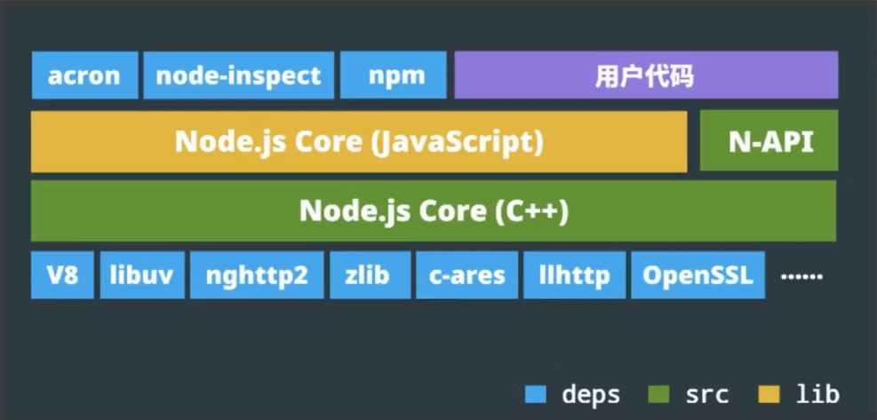

# Node.js入门与实践

## Node。js简介

Node.js是基于V8引擎的JavaScript运行环境。

Node.js允许JavaScript代码在服务器端运行，可以处理输入/输出、网络请求和数据库操作等。

### 特性
- 单线程
- 异步，非阻塞I/O
- 事件驱动
- 模块化
- 跨平台

### 非阻塞I/O

Node.js 中的I/O操作：访问文件系统、发起网络请求、读写外部存储等

阻塞I/O和非阻塞I/O的区别：系统接收输入到输出的时间段内，能否再接收其他输入。

### 异步编程

**异步编程**：指的是一种编程范式，通过异步方式处理I/O操作和其他异步操作，使得应用程序同时处理多个I/O操作，可以更好地处理高并发和大量的I/O操作，提高了应用程序的响应性能和吞吐量。

**异步编程处理方式**：
1. 回调函数callback：将一个函数作为参数传递给异步操作，异步操作完成后，回调函数被调用来处理返回结果。
2. Promise：Promise是一个代表异步操作最终完成或失败的对象，可以避免回调地狱问题。
3. async/await：async/await是ES6中引入的一种异步编程处理方式，通过async/await关键字来简化异步编程代码的编写。
4. 事件监听：Node.js采用事件驱动编程的方式来处理I/O操作，通过事件监听的方式来处理异步操作。

### 模块化

**模块化编程**是一种软件设计模式，将应用程序分解为独立的、可重用的组件，以提高代码的可读性、可维护性和可重用性。

**模块类型**
1. 核心模块：核心模块是Node.js自带的模块，例如fs、http、path等。
2. 第三方模块：由第三方开发者创建并发布的模块，可以通过npm来安装和使用。例如express，react等。

**模块规范**：CommonJS (CJS) 与 ES6 模块 (ESM) 

| 对比项         | CommonJS (CJS)                                      | ES6 模块 (ESM)                                  |
| :------------- | :-------------------------------------------------- | :---------------------------------------------- |
| **语法**       | `require()` 导入，`module.exports` / `exports` 导出 | `import` 导入，`export` / `export default` 导出 |
| **加载方式**   | 运行时动态加载，同步执行                            | 编译时静态加载，支持 Tree Shaking               |
| **适用环境**   | 主要用于 Node.js 环境                               | 浏览器原生支持，Node.js 也已全面支持            |
| **文件扩展名** | 通常为 `.js`，Node.js 中也可使用 `.cjs`             | 通常为 `.js`，也可使用 `.mjs` 显式声明          |
| **顶层 this**  | 指向当前模块对象                                    | 指向 `undefined`                                |
| **循环依赖**   | 支持，但可能导出未完全初始化的对象                  | 支持，通过“活绑定”机制处理                      |

## Node.js核心模块

| 模块名          | 功能说明                                                                                                |
| --------------- | ------------------------------------------------------------------------------------------------------- |
| **fs**          | 文件系统模块。文件的读写操作，包括文件的创建、读取、写入、重命名、删除、更改权限等。                    |
| **http**        | HTTP 服务器模块。创建 HTTP 服务器，处理 HTTP 请求和响应，包括监听端口、解析请求参数、路由、响应处理等。 |
| **path**        | 路径模块，提供了处理文件路径的方法，包括路径拼接、解析等。                                              |
| **os**          | 操作系统模块，提供一些操作系统相关的方法，包括获取操作系统信息、处理路径、内存使用等。                  |
| **events**      | 事件模块，可以用于实现事件驱动的编程模式，包括绑定事件、触发事件、监听事件等。                          |
| **querystring** | 查询字符串模块，用于解析和格式化 URL 查询字符串。                                                       |
| **url**         | URL 模块，用于解析和格式化 URL，包括获取协议、主机名、路径、查询参数等。                                |
| **stream**      | 流模块，用于处理流数据，实现数据的流式传输和处理，包括文件读取、压缩、加密、解密等。                    |

## 调试
- V8 inspector (https://nodejs.org/en/docs/guides/debugging-getting-started/)

### 压力测试
- ab (Apache Bench)
- webbench

### 内存性能
Memory Heapdump

### CPU性能
CPU Profile